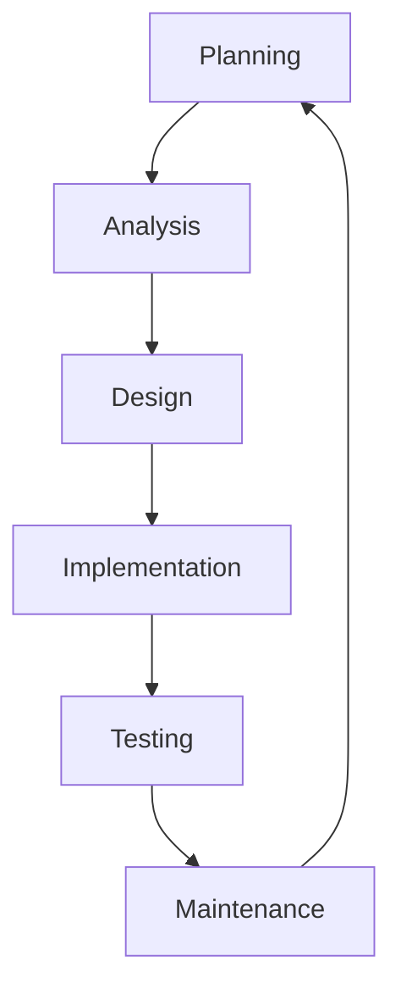

# Final Year Project

**Title:** "Develop & Test custom security rules for open source SAST tools (Semgrep & CodeQL)"
 
**People working on Project:** Doyinsola Sotunbo(22413014)
 
**Language:** YAML, Python, Bash
 
**Tools:** GitHub, GitHub Actions, DefectDojo, Playwright
 
**Aim:** I aim to develop and test custom security rules in GitLab and use these 2 open source SAST tools, Semgrep and CodeQL. I would also like to automate the security scan that uses the rules using GitLab CI/CD workflows. This workflow will automatically scan the repository after every code push to check for vulnerabilities and coding issues. I will also use intentionally vulnerable web applications such as WebGoat and JuiceShop to test these security rules. I will also explain how important security checks and verification is in the software development lifecycle to further express how important security is.

| Chapters | Description          |
| ------- | ------------------ |
| **Introduction**  | For the introduction, I will explain the aim of the project. I show and describe my plan in detail, how I started the project, the importance of the project in the software development lifecycle and how the CI/CD workflow scans are of great benefit|
| **SAST Tools**   | Explain the 2 SAST tools being used, Semgrep and CodeQL. Elaborate on why I used them, what benefit these tools are and the importance of these tools in this project              |
|  **CI/CD workflows**   | For this section I will explain what CI/CD is, the methodology and how benefitial it is. I will also explain how I created the workflows, how / where I learned YAML and talk about how the workflows run in GitHub Actions |
|  **Vulnereable Projects** | I have imported 2 intentionally vulnerable projects, they are simply 2 web application with alot of faults in them. I will basically use these web applications to test my security rules; the goal is to see if my security rules can pick up a large number of faults inside each folder.             |
|    | |

# SDLC (Software Development Life Cycle)

